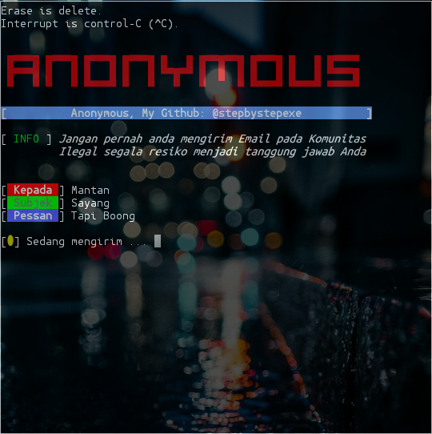

<p align="left">
  <a></a>
 </p>
<p align="center">
  
  Anonymous is a decentralized international hac acktivist group formed in 2003. Its members can be distinguished in public by wearing a Guy Fawkes mask or commonly known as V for Vendetta.
</p>
<p align="center">
  <a href="https://www.python.org">
    
  </a>
  <a href="https://github.com/stepbystepexe/Anonymous/blob/master/LICENSE">
    
  </a>
  <a href="https://github.com/stepbystepexe/Anonymous/releases">
    
  </a>
  <a href="https://github.com/stepbystepexe/Anonymous/pulls">
    
  </a>
  <a href="https://github.com/stepbystepexe/Anonymous/projects">
    
  </a>
  <a href="https://github.com/stepbystepexe/Anonymous/issues">
    
  </a>
  <a href="https://github.com/stepbystepexe/Anonymous/security/policy">
    
  </a>
  <a href="https://opensource.org">
    
  </a>
</p>
<p align="center">
  Screenshot
</p>
<p align="center">
  
</p>
<h5>
<p align="center">
  Made with ❤️ by <a href="https://github.com/stepbystepexe">Nedi Senja</a>
</p>
</h5>
<p align="center">
 
</p>

### Information:
```text
Name        : Anonymous
Version     : 1.3 (Update: 31 March 2020, 1:10 AM)
Date        : 29 September 2019
Author      : Nedi Senja
Purpose     : Send a message to Anonymous
              anonymously.
Thankyou    : Allah SWT.
              FR13NDS, & all over
              humans on planet earth
NB          : Humans are not perfect
              as rich as this tool.
              Please report criticism or suggestions
              To - Email: d_q16x@outlook.co.id
                 - WhatsApp: tinyurl.com/wel4alo

[ Use this tool wisely. Thanks ]
```

### Features:
+ anonymouse.org

### Installation:
```text
git clone https://github.com/stepbystepexe/Anonymous
cd Anonymous
ls
chmod +x
./anonymous.py
```
### Contact:

<h5> <a href="http://d_q16x@outlook.co.id">Email: d_q16x@outlook.co.id</a>
</h5>
<h5> <a href="https://tinyurl.com/wel4alo">WhatsApp: tinyurl.com/wel4alo</a>
</h5>

### LiberaPay:
<noscript><a href="https://liberapay.com/stepbystepexe/donate"></a></noscript>

>**Created by Stepbystep**
